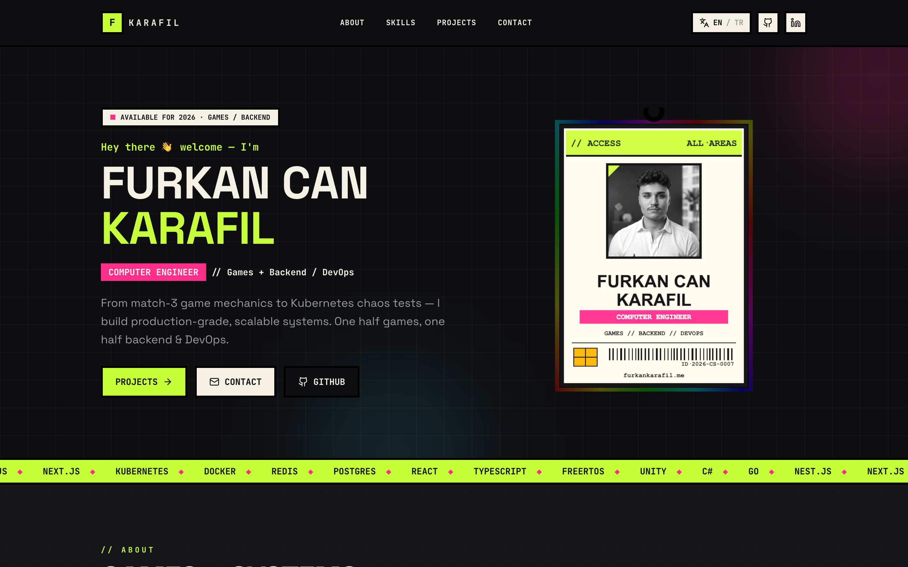
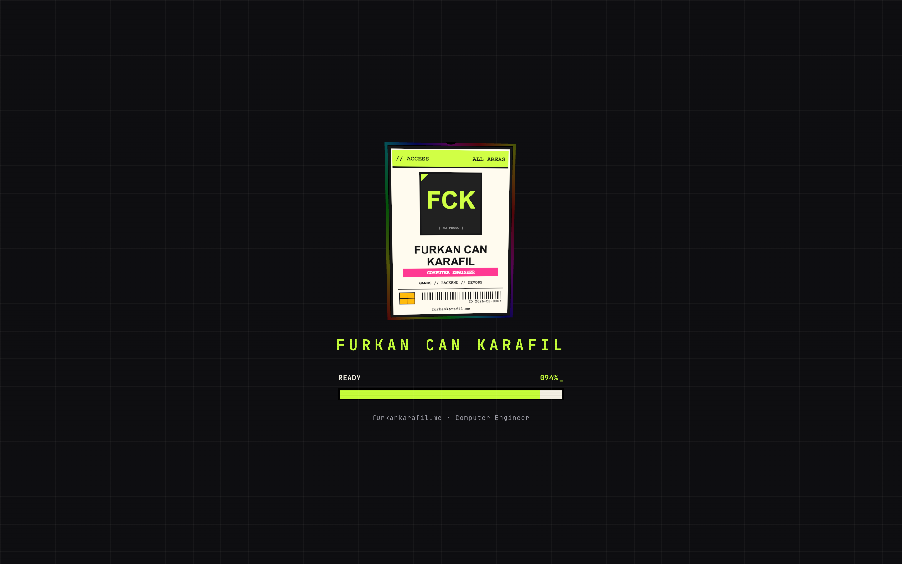
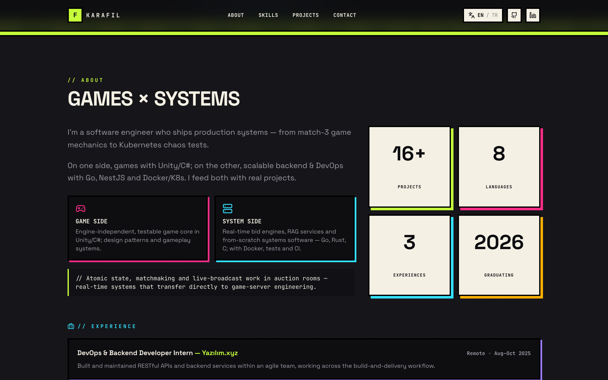
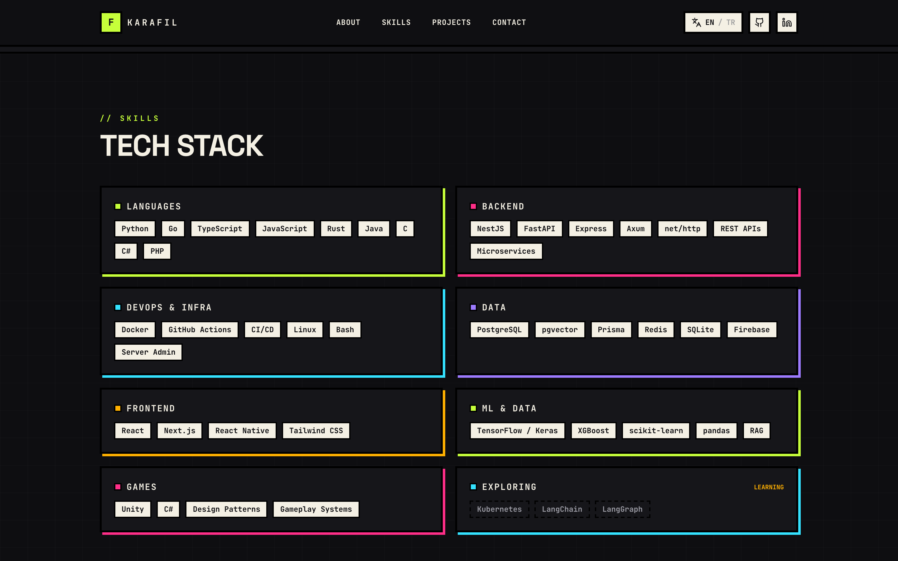
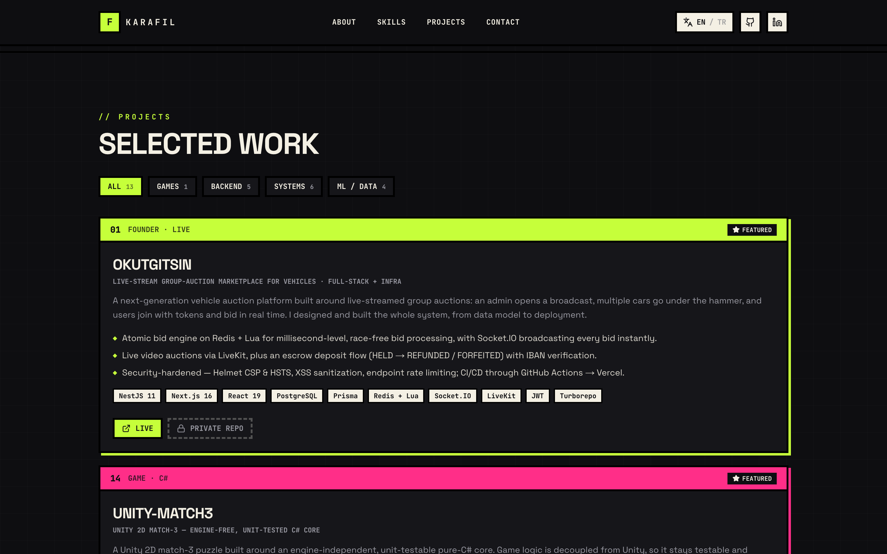
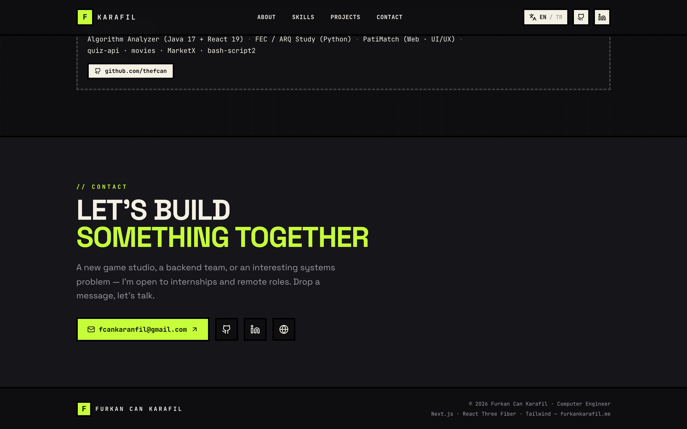
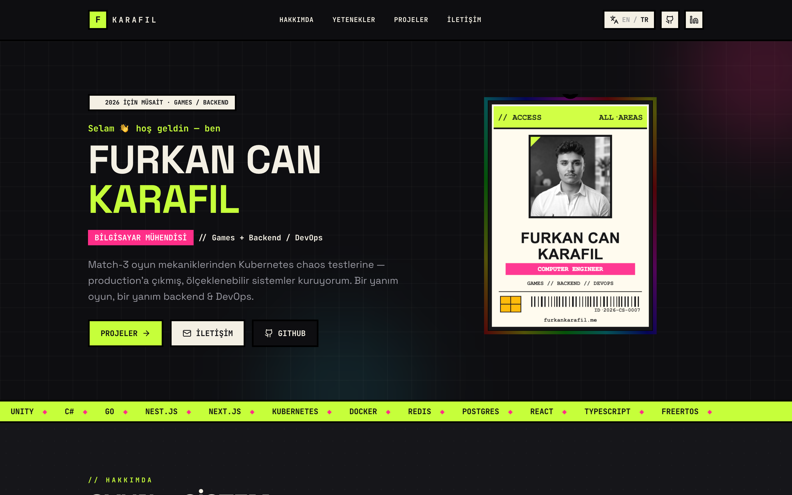

<div align="center">



# Furkan Can Karafil — Portfolio

**Computer Engineer · Games + Backend / DevOps**

A from-scratch, neo-brutalist / retro-arcade portfolio with a live **3D ID card**, a boot sequence, in-page transition screens, and a built-in **English ⇄ Turkish** switch.

[](https://furkankarafil.me)
&nbsp;
[](https://nextjs.org)
[](https://react.dev)
[](https://www.typescriptlang.org)
[](https://r3f.docs.pmnd.rs)
[](https://tailwindcss.com)

**→ [furkankarafil.me](https://furkankarafil.me)**

</div>

---

## Overview

This is a complete rebuild of my personal portfolio — held nothing from the original scaffold. The goal was a site that doubles as a portfolio **and** a demo: hybrid positioning (games **and** backend/DevOps), a memorable visual identity, and a signature interactive piece.

The result is a **neo-brutalist / retro-arcade** single page driven by an interactive **3D access-card** that carries my photo, role and a holographic back layer. The whole thing is bilingual, accessible, and ships as a statically-prerendered Next.js app on Vercel.

## ✨ Highlights

- **Live 3D ID card** — React Three Fiber. The card face is painted to a 2D `<canvas>` and used as a texture; the back is a fresnel-based **holographic GLSL shader**. It tilts to the pointer on the hero and spins during the boot screen.
- **Boot sequence + section transitions** — a brutalist boot loader (rotating 3D card, decrypting name, progress bar) on first paint, plus a quick transition screen when you jump between sections.
- **Bilingual, EN default** — a tiny i18n layer with an `EN / TR` toggle (persisted). Browser auto-translation is **disabled on purpose**, so technical terms stay in their original form (no “Docker → liman işçisi”).
- **Neo-brutalist design system** — thick black borders, hard neon offset shadows, zero radius, arcade marquee, scanlines and a terminal “decrypt” text effect — all from a Tailwind v4 CSS-first `@theme`.
- **13 curated projects** — filterable by `Games / Backend / Systems / ML`, with featured cards highlighting OkutGitsin, unity-match3 and RagDesk.
- **Accessible & resilient** — respects `prefers-reduced-motion` (softens motion instead of freezing the page) and feature-detects WebGL, falling back to a static card with a graceful photo.
- **SEO ready** — Open Graph / Twitter metadata, canonical URL, brand favicon.

## 📸 Screenshots

|  |  |
|:--:|:--:|
| **Boot / loading** | **About — hybrid framing** |
|  |  |
| **Skills** | **Projects — filterable** |
|  |  |
| **Contact** | **Turkish mode** |
|  |  |

## 🧱 Tech Stack

| Area | Tools |
|---|---|
| **Framework** | Next.js 16 (App Router) · React 19 · TypeScript |
| **3D / graphics** | React Three Fiber · three.js · custom GLSL shader · Canvas 2D texture |
| **Styling** | Tailwind CSS v4 (CSS-first `@theme`) · shadcn/ui primitives |
| **Motion** | Framer Motion · GSAP · rAF text scramble |
| **Fonts** | Space Grotesk · JetBrains Mono (`next/font`) |
| **Tooling** | pnpm · ESLint · Turbopack |
| **Hosting** | Vercel · custom domain (Namecheap) |

## 🏗️ How it’s built

A few decisions worth calling out:

- **Design system first.** `app/globals.css` defines the whole language — an ink/cream/neon palette, a shadcn token bridge (so `ui/*` keeps working), brutalist component classes (`.brutal*`), retro utilities (grid, dots, scanlines) and keyframes — using Tailwind v4’s `@theme inline`. No `tailwind.config.js`.
- **The signature card.** Instead of a 3D model, the card face is **drawn to a canvas** (name, photo, barcode, chip…) and used as a `CanvasTexture`. A separate plane behind it runs a **holographic shader** (iridescent fresnel that shifts over time). Cheap, sharp, and fully data-driven from `lib/profile.ts`.
- **Two kinds of motion.** A real WebGL canvas powers the boot loader and hero; in-page section jumps use a **cheap CSS-3D mini-card** so we never pay for spinning up a new WebGL context per transition.
- **A real i18n layer, not auto-translate.** All copy lives bilingually in `lib/*` + a `ui` dictionary; a context provider exposes `t()`. Browser translation is turned off so the careful “keep tech terms in English” rule survives.
- **Accessibility as a feature, not an afterthought.** `prefers-reduced-motion` softens (rather than kills) animation, and a WebGL feature-test guarantees a clean static fallback.

## 📁 Project structure

```
app/
  layout.tsx          # fonts, SEO/metadata, providers, notranslate
  page.tsx            # section composition
  globals.css         # neo-brutalist design system (Tailwind v4 @theme)
  icon.svg            # brand "F" favicon
components/
  header.tsx hero-section.tsx about-section.tsx
  skills-section.tsx projects-section.tsx footer.tsx
  scramble-text.tsx                  # terminal "decrypt" reveal
  i18n/lang-provider.tsx             # EN/TR context + toggle
  three/id-card-3d.tsx               # R3F card, canvas texture + shader
  transition/transition-provider.tsx # boot loader + section transitions
  ui/                                # shadcn primitives
lib/
  i18n.ts profile.ts projects.ts resume.ts   # bilingual content + UI dict
public/  me.jpg
docs/screenshots/
```

## 🚀 Local development

```bash
pnpm install
pnpm dev          # http://localhost:3000
pnpm build        # production build
pnpm start        # serve the production build
```

> Editing content? It all lives in `lib/` — `profile.ts` (identity), `projects.ts` (work), `resume.ts` (skills/experience) and `i18n.ts` (UI strings). Drop a new photo in `public/` and point `profile.photoUrl` at it.

## ☁️ Deployment

Deployed on **Vercel** with automatic builds on push to `main`, served from the custom domain **[furkankarafil.me](https://furkankarafil.me)**.

---

<div align="center">

Built by **Furkan Can Karafil** · [furkankarafil.me](https://furkankarafil.me) · [github.com/thefcan](https://github.com/thefcan)

</div>
